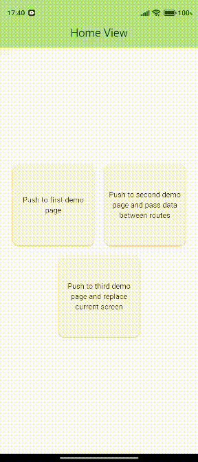
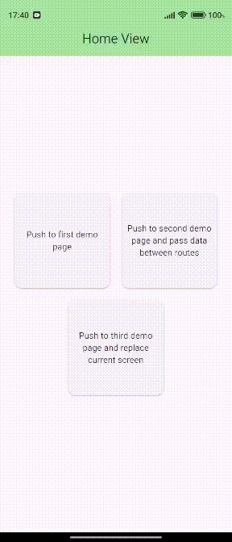
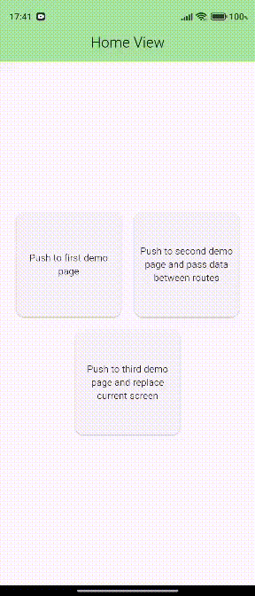

# Advanced Navigation Manager

This project is an example of an advanced and centralized navigation manager for Flutter that doesn't require context.

## 📱 Example Screenshots

<p float="left">
  
  
  
</p>

## 📁 Project Folder Structure

```
advanced_navigation_manager/
│
├── lib/
│   ├── main.dart
│   ├── src/
│   │   ├── core/
│   │   │   ├── exception/
│   │   │   │   └── navigation_exception.dart
│   │   │   ├── mixins/
│   │   │   │   └── navigation_mixin.dart
│   │   │   ├── navigation/
│   │   │   │   ├── navigation_manager.dart
│   │   │   │   ├── navigation_animation.dart
│   │   │   │   └── route_name.dart
│   │   │   ├── theme/
│   │   │   │   └── theme.dart
│   │   │   └── components/
│   │   │       └── snackbar.dart
│   │   └── feature/
│   │       ├── home/
│   │       │   └── view/
│   │       │       └── home_view.dart
│   │       └── demo_pages/
│   │           ├── view/
│   │           │   ├── first_screen_view.dart
│   │           │   ├── second_screen_view.dart
│   │           │   └── third_screen_view.dart
│   │           └── widgets/
│   │               └── custom_card_button.dart
```

## Difference Between Normal Flutter Navigation and Advanced Navigation

### ❌ Flutter's Normal Method:
```dart
// Long and complex syntax
Navigator.of(context).push(MaterialPageRoute(builder: (context) => HomeView()));

// String-based routes (risk of typos)
Navigator.of(context).pushNamed('/home');
```

### ✅ Advanced Navigation Manager:
```dart
// Clean and short syntax
router.goToPage(RouteName.firstDemoScreen);
```

## 🔐 Safe Route Naming

In normal push operations, when navigating with URLs like `/home` or `/`, we risk getting errors due to typos. When we convert this to an enum and add this feature with an extension, things become safer.

```dart
enum RouteName { 
  home, 
  firstDemoScreen, 
  secondDemoScreen, 
  thirdDemoScreenView 
}

extension RouteNameExtension on RouteName {
  String get withParaf => "/$name";  // "/home", "/firstDemoScreen" format
}
```

## ⚙️ Route Generator Setup

To use this navigation system, we need to write our own route generator in MaterialApp. Adding the `settings` parameter for route animations used here is essential for data transfer between pages. If you're using `MaterialPageRoute` directly, these are provided by default, but for custom routes, this must be specified.

```dart
class RouteGenerator {
  static Route<dynamic> generateRoute(RouteSettings settings) {
    String? name = settings.name;
    if (name == RouteName.home.withParaf) {
      return FadeRoute(child: HomeView(), settings: settings);
    } else if (name == RouteName.firstDemoScreen.withParaf) {
      return FadeRoute(child: FirstDemoScreenView(), settings: settings);
    } else if (name == RouteName.secondDemoScreen.withParaf) {
      return FadeRoute(child: SecondDemoScreenView(), settings: settings);
    } else if (name == RouteName.thirdDemoScreenView.withParaf) {
      return FadeRoute(child: ThirdDemoScreenView(), settings: settings);
    } else {
      return throw NavigationException("Route not found");
    }
  }
}
```

## 📱 MaterialApp Configuration

In MaterialApp, we need to configure it as follows and **importantly add the global key**:

```dart
@override
Widget build(BuildContext context) {
  return MaterialApp(
    onGenerateRoute: RouteGenerator.generateRoute,
    navigatorKey: router.navigationGlobalKey, // Add NavigationManager's global key. You will see where the code comes from later.
    title: "Advanced Navigation Manager",
    home: HomeView(),
  );
}
```

**Note:** The `navigatorKey: router.navigationGlobalKey` line is crucial because this global key allows the NavigationManager to control navigation operations without needing context. Without this key, the navigation manager cannot access the Navigator state.

## 🏗️ Navigation Manager Class

Now that we've set up the environment, our custom manager can be written like this:

```dart
abstract class INavigationManager {
  Future<dynamic> goToPage(RouteName route, {Object? arguments});
  void popPage({Object? result});
  Future<void> replacePageTo(RouteName route, {Object? arguments});
  Future<void> popAndPushToPage(RouteName route, {Object? arguments});
}

class NavigationManager implements INavigationManager {
  /// This class is a singleton for centralized access.
  /// [NavigationMixinStateful] and [NavigationMixinStateless] mixins
  /// handle all navigation processes in a clean and consistent way.
  
  NavigationManager._();
  static NavigationManager instance = NavigationManager._();

  final GlobalKey<NavigatorState> _navigationGlobalKey = GlobalKey<NavigatorState>();
  GlobalKey<NavigatorState> get navigationGlobalKey => _navigationGlobalKey;

  /// Sometimes the app needs to transfer data between pages.
  /// This function allows sending optional arguments and receiving data from the next page.
  @override
  Future<dynamic> goToPage(RouteName route, {Object? arguments}) async {
    return await _navigationGlobalKey.currentState?.pushNamed(
      route.withParaf,
      arguments: arguments,
    );
  }

  @override
  void popPage({Object? result}) {
    _navigationGlobalKey.currentState?.pop(result);
  }

  /// These two functions have similar purposes.
  /// [replacePageTo] removes the current page, so you cannot go back.
  /// It can send data via arguments but cannot return any data.
  @override
  Future<void> replacePageTo(RouteName route, {Object? arguments}) async {
    await _navigationGlobalKey.currentState?.pushReplacementNamed(
      route.withParaf,
      arguments: arguments,
    );
  }

  @override
  Future<void> popAndPushToPage(RouteName route, {Object? arguments}) async {
    await _navigationGlobalKey.currentState?.popAndPushNamed(
      route.withParaf,
      arguments: arguments,
    );
  }
}
```

## 🧩 Clean Access with Mixins

Direct usage of this manager can be written using the global key directly as follows, but to make this cleaner, we can use mixins:

```dart
// Direct usage (not recommended)
NavigationManager.instance.goToPage(RouteName.home);
```

The following two mixins are written specifically for StatefulWidget and StatelessWidget, and by directly including them in widgets, very clean code can be written by accessing the router:

```dart
mixin NavigationMixinStateful<T extends StatefulWidget> on State<T> {
  NavigationManager get router => NavigationManager.instance;
}

mixin NavigationMixinStateless on StatelessWidget {
  NavigationManager get router => NavigationManager.instance;
}
```

## 📱 Example Usage

### Usage with StatefulWidget:
```dart
class SecondDemoScreenView extends StatefulWidget {
  SecondDemoScreenView({super.key});

  @override
  State<SecondDemoScreenView> createState() => _SecondDemoScreenViewState();
}

class _SecondDemoScreenViewState extends State<SecondDemoScreenView> with NavigationMixinStateful { //<--
  
  @override
  Widget build(BuildContext context) {
    return Scaffold(
      appBar: AppBar(
        leading: BackButton(
          onPressed: () {
            router.popPage(result: "Message: $message");// result paramaeter is optional 
          },
        ),
      ),
      // Widget content...
    );
  }
}
```

### Usage with StatelessWidget:
```dart
class FirstDemoScreenView extends StatelessWidget with NavigationMixinStateless { //<--
  FirstDemoScreenView({super.key});

  @override
  Widget build(BuildContext context) {
    return Scaffold(
      appBar: AppBar(
        leading: BackButton(
          onPressed: () {
            router.popPage();
          },
        ),
      ),
      // Widget content...
    );
  }
}
```

## 🚀 Navigation Functions

| Function | Description | Example Usage |
|----------|-------------|---------------|
| `goToPage()` | Navigate to new page, send/receive data | `router.goToPage(RouteName.home)` |
| `popPage()` | Go back, send result | `router.popPage(result: data)` |
| `replacePageTo()` | Replace current page | `router.replacePageTo(RouteName.login)` |
| `popAndPushToPage()` | Pop and push new page | `router.popAndPushToPage(RouteName.dashboard)` |

## 📊 Data Transfer Between Pages

This project demonstrates `goToPage`, `popPage`, `replacePageTo`, `popAndPushToPage` functions and data transfer between pages with example screenshots.

### Sending Data:
After a page is closed using the popPage function, the argument passed to popPage will be returned as the result.
```dart
String result = await router.goToPage(
  RouteName.secondDemoScreen,
  arguments: 'This data was sent from the home page',
);
```

### Receiving Data:
```dart
@override
void didChangeDependencies() {
  super.didChangeDependencies();
  final args = ModalRoute.of(context)?.settings.arguments;
  if (args != null) {
    // Use the data
  }
}
```

## Advantages

- ✅ **No Context Required**: No need to pass context thanks to mixins
- ✅ **Type Safe**: Compile-time error checking with enum usage
- ✅ **Centralized Management**: All navigation operations controlled from one place
- ✅ **Clean Code**: Short and understandable syntax
- ✅ **Custom Animations**: Custom route animations can be easily added
- ✅ **Data Transfer**: Data sending and receiving between pages is very simple

## Installation

1. Clone the repository:  
   `git clone https://github.com/CodeByQafar/advanced_navigation_manager.git`

2. Install dependencies:  
   `dart pub get`

3. Run the application:  
   `flutter run`


